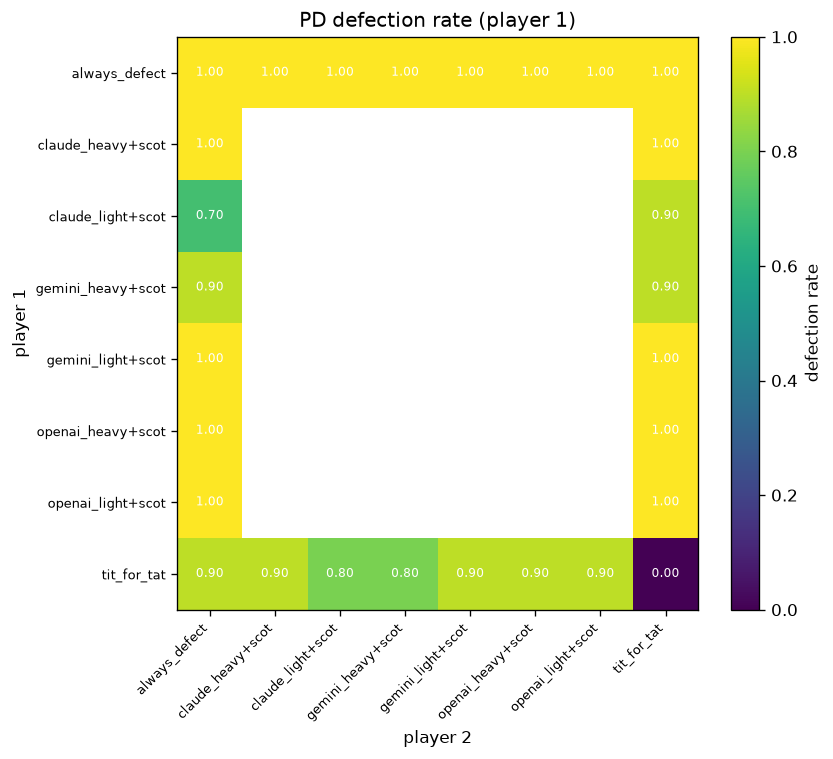
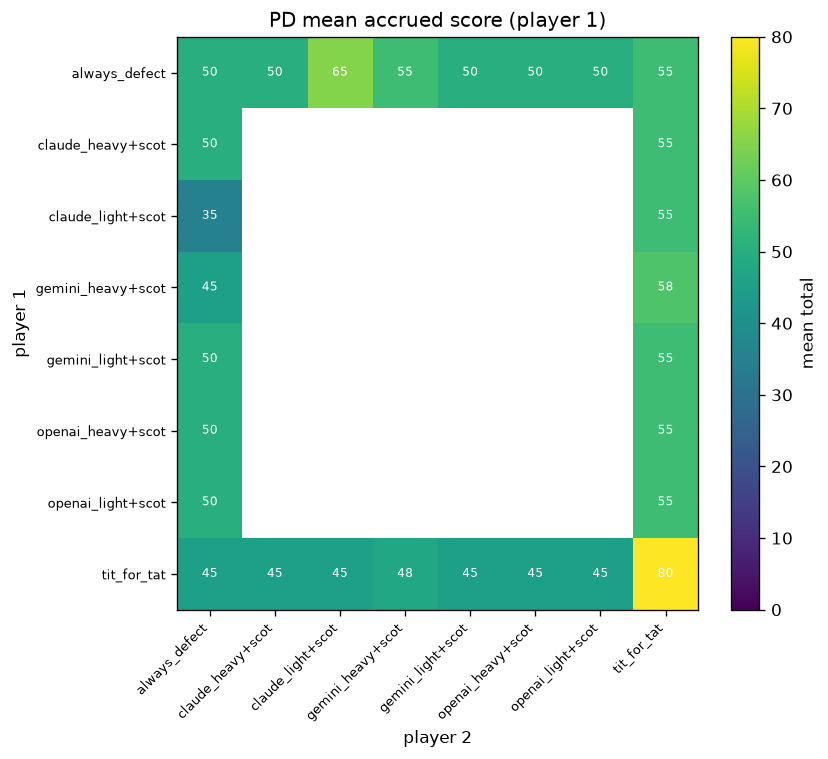
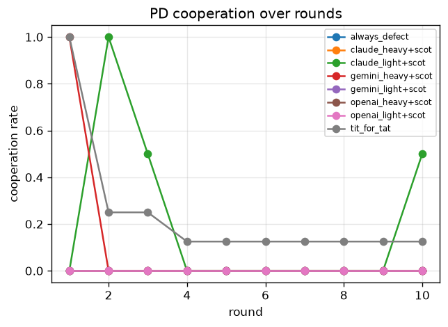
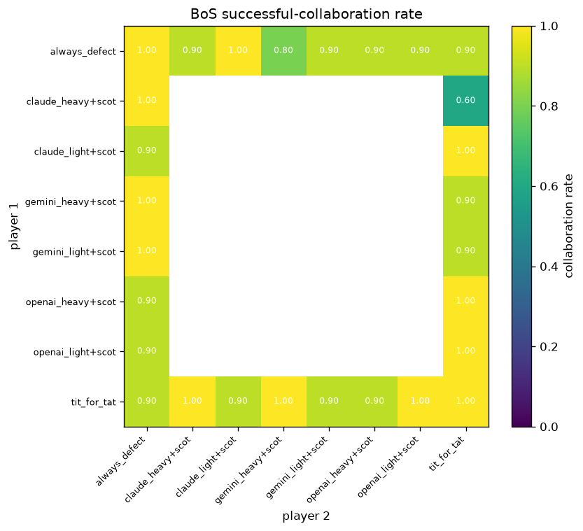
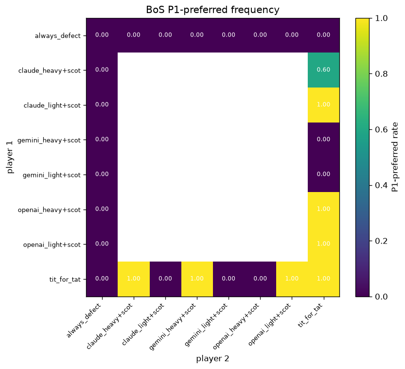
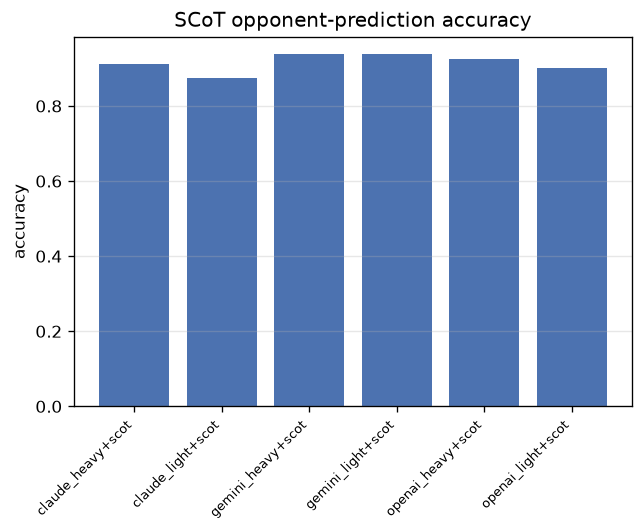
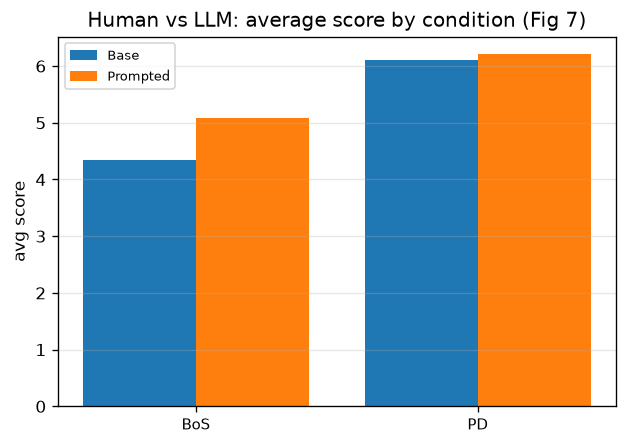

# Results — `llm_gw_scot`

Reproduction of Akata et al. (2025), *Playing repeated games with large language models* (Nature Human Behaviour). Generated by the `llmgames` harness.

▶ **Animated game replay:** open [`game_replay.html`](game_replay.html) in a browser to watch any matchup play out round by round.

## Run configuration
- **Mode**: scot
- **Rounds**: 10
- **Seed**: 42
- **Opponents**: tit_for_tat, always_defect
- **Robustness**: order_randomized=True, unit=points, cover_story=none, labels=J/F
- **Models**:
- `openai_heavy` — provider `openai`, model `gpt-4.1`, temp 0.0
- `openai_light` — provider `openai`, model `gpt-4.1-mini`, temp 0.0
- `gemini_heavy` — provider `openai`, model `gemini-3.1-pro-preview`, temp 0.0
- `gemini_light` — provider `openai`, model `gemini-3.1-flash-lite`, temp 0.0
- `claude_heavy` — provider `openai`, model `claude-opus-4-6`, temp 0.0
- `claude_light` — provider `openai`, model `claude-haiku-4-5`, temp 0.0

## Payoff matrices

### Prisoner's Dilemma (PD Family)

| P1 \ P2 | J | F |
|---|---|---|
| **J** | (8, 8) | (0, 10) |
| **F** | (10, 0) | (5, 5) |

### Battle of the Sexes (BoS)

| P1 \ P2 | J | F |
|---|---|---|
| **J** | (10, 7) | (0, 0) |
| **F** | (0, 0) | (7, 10) |

## Table 1 — score ratio (achieved / best achievable)

| player | family | score_ratio | n_matches |
| --- | --- | --- | --- |
| always_defect | BoS | 0.923 | 16 |
| always_defect | PD Family | 1.000 | 16 |
| claude_heavy+scot | BoS | 0.885 | 4 |
| claude_heavy+scot | PD Family | 1.000 | 4 |
| claude_light+scot | BoS | 0.957 | 4 |
| claude_light+scot | PD Family | 0.808 | 4 |
| gemini_heavy+scot | BoS | 0.916 | 4 |
| gemini_heavy+scot | PD Family | 0.933 | 4 |
| gemini_light+scot | BoS | 0.923 | 4 |
| gemini_light+scot | PD Family | 1.000 | 4 |
| openai_heavy+scot | BoS | 0.932 | 4 |
| openai_heavy+scot | PD Family | 1.000 | 4 |
| openai_light+scot | BoS | 0.950 | 4 |
| openai_light+scot | PD Family | 1.000 | 4 |
| tit_for_tat | BoS | 0.928 | 16 |
| tit_for_tat | PD Family | 0.874 | 16 |

## Prisoner's Dilemma

## Battle of the Sexes

## Prediction accuracy (theory of mind, Fig 6)

| player | accuracy | n_predictions |
| --- | --- | --- |
| claude_heavy+scot | 0.912 | 80 |
| claude_light+scot | 0.875 | 80 |
| gemini_heavy+scot | 0.938 | 80 |
| gemini_light+scot | 0.938 | 80 |
| openai_heavy+scot | 0.925 | 80 |
| openai_light+scot | 0.900 | 80 |

## Human study (Fig 7)

Real 195-participant dataset (Base vs SCoT-Prompted GPT-4).

| game | opponent | avg_score | cooperation_rate | success_rate | mutual_cooperation_rate | n_rounds | p_human | n_participants |
| --- | --- | --- | --- | --- | --- | --- | --- | --- |
| BoS | Base | 4.340 | 0.465 | 0.542 |  | 970 | 0.361 | 97 |
| BoS | Prompted | 5.077 | 0.462 | 0.622 |  | 980 | 0.469 | 98 |
| PD | Base | 6.109 | 0.500 |  | 0.373 | 970 | 0.485 | 97 |
| PD | Prompted | 6.207 | 0.455 |  | 0.363 | 980 | 0.643 | 98 |

